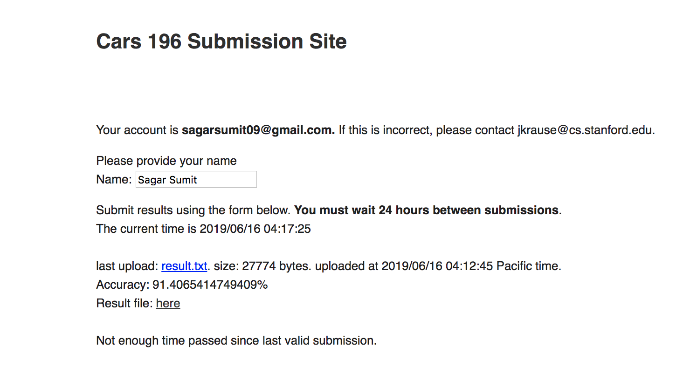
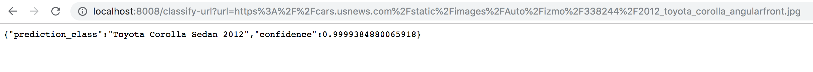

# aiforsea-cv-cars


This project is to do car recognition by transfer learning, fine-tuning ResNet models with Cars Dataset from Stanford. It was done in pursuance of finding a solution to the [Grab AI for SEA](https://www.aiforsea.com/) challenge.

Table of contents
=================

<!--ts-->
   * [Summary](#summary)
   * [Recent state-of-the-art results](#recent-state-of-the-art-results)
   * [Dependencies](#dependencies)
   * [Development platform](#development-platform)
   * [Usage](#usage)
      * [Prerequisites](#prerequisites)
      * [Steps](#steps)
      * [Some examples](#some-examples)
      * [Setup docker](#setup-docker)
   * [Citations and Acknowledgements](#citations-and-acknowledgements)
<!--te-->
## Summary

- Trained and tested with ResNet50, Resnet101, ResNet152. Different notebooks can be found in `experiments` folder. However, the solution that I intend to submit is in [cv-stanford-cars.ipynb](cv-stanford-cars.ipynb) notebook and the model file is [`export-rn101_train_stage2-50e.pkl`](export-rn101_train_stage2-50e.pkl). It achieves 91.4% accuracy on test set provided by [Stanford](https://ai.stanford.edu/~jkrause/cars/car_dataset.html). For inference, please refer to the usages of [inference.py](inference.py) in [Usage](#usage) section.
- Ceteris paribus, a model with denser networks performed better. But, there is a trade-off between resources and accuracy. So, the goal of this project was to arrive at a good model (say > 90% accuracy, without overfitting) within a faster training time. Given more time and resources, we could definitely experiment and fine-tune more to improve accuracy.
- With this goal in mind, I could come up with **90.7% on validation set and 91.4% on test set** by fine-tuning ResNet101. Specifically, I used a differential learning rate between `slice(1e-4,1e-3)` over 40 epochs, with a momentum of `Point(0.95, 0.85)`. The process of training and intuition behind tuning could be found in [cv-stanford-cars.ipynb](cv-stanford-cars.ipynb) notebook. With ResNet152, I was able to get to 91.8% accuracy with [mixup](https://arxiv.org/abs/1710.09412) but the model was overfitting. 

To learn about how to run and test, jump to [Usage](#usage) section below. Here's a screenshot of my submission of result.


## Recent state-of-the-art results
- [Deep CNNs With Spatially Weighted Pooling for Fine-Grained Car Recognition](https://www.researchgate.net/publication/316027349_Deep_CNNs_With_Spatially_Weighted_Pooling_for_Fine-Grained_Car_Recognition): 93.6% (April, 2018)
- [Weakly Supervised Data Augmentation Network for Fine-Grained Visual Classification](https://arxiv.org/abs/1901.09891): 94.5% (March, 2019)

## Dependencies

- [NumPy](http://docs.scipy.org/doc/numpy-1.10.1/user/install.html)
- [PyTorch](https://pytorch.org/get-started/locally/)
- [Fastai](https://github.com/fastai/fastai/blob/master/README.md#installation)
- [OpenCV](https://opencv-python-tutroals.readthedocs.io/en/latest/)

## Development platform
 
- Google Deep Learning VM based on: Debian GNU/Linux 9.9 (stretch) (GNU/Linux 4.9.0-9-amd64 x86_64\n)
- Machine Type: n1-highmem-8 (8 vCPUs, 52 GB memory)
- Python 3.7, PyTorch 1.1, Fastai 1.0.52
 ```bash
$ python
Python 3.7.0 (default, Oct  9 2018, 10:31:47)
[GCC 7.3.0] :: Anaconda, Inc. on linux
Type "help", "copyright", "credits" or "license" for more information.
>>> import torch
>>> torch.__version__
'1.1.0'
>>> import fastai
>>> fastai.__version__
'1.0.52'
``` 
- GPU: NVIDIA Tesla P4, CUDA version 10.0
```bash
$ nvidia-smi
Sat Jun 15 06:42:17 2019
+-----------------------------------------------------------------------------+
| NVIDIA-SMI 410.104      Driver Version: 410.104      CUDA Version: 10.0     |
|-------------------------------+----------------------+----------------------+
| GPU  Name        Persistence-M| Bus-Id        Disp.A | Volatile Uncorr. ECC |
| Fan  Temp  Perf  Pwr:Usage/Cap|         Memory-Usage | GPU-Util  Compute M. |
|===============================+======================+======================|
|   0  Tesla P4            Off  | 00000000:00:04.0 Off |                    0 |
| N/A   53C    P0    24W /  75W |   5953MiB /  7611MiB |      0%      Default |
+-------------------------------+----------------------+----------------------+

+-----------------------------------------------------------------------------+
| Processes:                                                       GPU Memory |
|  GPU       PID   Type   Process name                             Usage      |
|=============================================================================|
|    0      8503      C   /opt/anaconda3/bin/python                   5943MiB |
+-----------------------------------------------------------------------------+
```

## Usage

As mentioned by the [AI challenge](https://www.aiforsea.com/computer-vision), the project uses the [Cars Dataset](https://ai.stanford.edu/~jkrause/cars/car_dataset.html), which contains 16,185 images of 196 classes of cars. The data is split into 8,144 training images and 8,041 testing images, where each class has been split roughly in a 50-50 split.

In addition, I have also [setup a docker](#setup-docker), which can be built to start a server locally where you can upload an image or give the image url to get the class prediction.

To setup and run the project follow the steps below.

#### Prerequisites

- Any last stable standard Linux distribution. Below steps have been tested on Debian GNU/Linux 9.9 (stretch). But, Ubuntu 16.04 or 18.04 should be fine too. Note that, [Fastai](https://github.com/fastai/fastai/blob/master/README.md#installation), that is being used in this project, **currently supports Linux only**, and requires PyTorch v1 and Python 3.6 or later. Moreover, CUDA support on macOS is only available by building PyTorch from source and I have not tested that. So, it is recommended that Linux is used.
- Install [PyTorch](https://pytorch.org/get-started/locally/) and [Fastai](https://github.com/fastai/fastai/blob/master/README.md#installation) latest stable version as mentioned in [Development platform](#development-platform) section above.

#### Steps

- Clone the repo and move to the root directory of the repo. Alternatively, you can download if you don't want to clone.
```bash
$ git clone https://github.com/codope/aiforsea-cv-cars.git 
$ cd aiforsea-cv-cars/
$ git status
On branch master
Your branch is up-to-date with 'origin/master'.
nothing to commit, working tree clean
```
- Do a `pip install` of the dependencies in `requirements.txt`. If you already have all the dependencies then you should see an output like below, otherwise sit back and relax until all the dependencies are installed.
```bash
$ pip3 install -r requirements.txt
Requirement already satisfied: fbpca==1.0 in /usr/local/lib/python3.7/site-packages (from -r requirements.txt (line 1)) (1.0)
Requirement already satisfied: imageio==2.4.1 in /usr/local/lib/python3.7/site-packages (from -r requirements.txt (line 2)) (2.4.1)
Requirement already satisfied: numpy==1.16.4 in /usr/local/lib/python3.7/site-packages (from -r requirements.txt (line 3)) (1.16.4)
Requirement already satisfied: opencv-python==4.1.0.25 in /usr/local/lib/python3.7/site-packages (from -r requirements.txt (line 4)) (4.1.0.25)
Requirement already satisfied: pandas==0.24.2 in /usr/local/lib/python3.7/site-packages (from -r requirements.txt (line 5)) (0.24.2)
Requirement already satisfied: Pillow==6.0.0 in /usr/local/lib/python3.7/site-packages (from -r requirements.txt (line 6)) (6.0.0)
Requirement already satisfied: python-dateutil==2.8.0 in /usr/local/lib/python3.7/site-packages (from -r requirements.txt (line 7)) (2.8.0)
Requirement already satisfied: pytz==2019.1 in /usr/local/lib/python3.7/site-packages (from -r requirements.txt (line 8)) (2019.1)
Requirement already satisfied: scipy==1.3.0 in /usr/local/lib/python3.7/site-packages (from -r requirements.txt (line 9)) (1.3.0)
Requirement already satisfied: six==1.12.0 in /usr/local/lib/python3.7/site-packages (from -r requirements.txt (line 10)) (1.12.0)
Requirement already satisfied: starlette==0.12.0 in /usr/local/lib/python3.7/site-packages (from -r requirements.txt (line 11)) (0.12.0)
```
- Run the below script to get the data and organise it into ImageNet folder architecture style, the train/valid split is specified in 'train_split = 0.8' in [preprocess.py](preprocess.py). **Thanks to foamliu** for providing the preprocessing script on [this github repo](https://github.com/foamliu/Car-Recognition/blob/master/pre-process.py)
```bash
$ sh prepare_data.sh
```
Sit back and relax until you see the following message on the terminal:
```bash
The number of different cars is 196
Training data saved.
Processing test data...
Testing data saved.
```
NOTE: Please check the `aiforsea-cv-cars/model` directory. It must have `export-rn101_train_stage2-50e.pkl` file and it should be `171.15MB` in size. If you notice that the file was not downloaded completely then you can download the model from [here](https://drive.google.com/file/d/1NLh40ZAqzM-ik_dgAmfRXvGkMKti5G9C/view?usp=sharing).
- Execute the `inference.py` script to do inference from the pre-trained model. It accepts some arguments and syntax is as follows:
```bash
$ python inference.py [OPTION] <file_name>
```
`[OPTION]` is either one of :
1. `predict-one`
2. `with-accuracy`
3. `with-confidence`

`file_name` is the absolute path to either one of (depending on OPTION):
1. A .jpg image, if you want to predict class for one image using `predict-one` option.
2. `cars_test_annos_withlabels.mat` file containing the test data annotations, if you want to just know the accuracy of the model using `with-accuracy` option. Note that, the `cars_test_annos_withlabels.mat` file would have already been saved under the root directory of this project if `prepare_data.sh` script ran successfully. In case, it isn't there then you can download this file [here](http://imagenet.stanford.edu/internal/car196/cars_test_annos_withlabels.mat).
3. A .txt file, which will be the output file, if you want to get predictions for all test data in test set, including the confidence score using `with-confidence` option.

NOTE: `OPTION` is optional but `file_name` is mandatory argument. If you do not provide any option, the code will write the output to the `file_name` with only the class_id of the predictions for all the test data in the format that is acceptable at [Cars 196 Submission Site](http://imagenet.stanford.edu/internal/car196/submission/submission.php). Check the last example in the [examples section](#some-examples) below.
#### Some examples

- This one below shows the output of prediction of one image. Output is ine the format <class_id, class_name, confidence>. 
```bash
$ python inference.py predict-one /home/jupyter/ai-for-sea/data/2012-toyota-camry-hybrid-test-review-car-and-driver-photo-434698-s-original.jpg
187, Toyota Camry Sedan 2012, 0.9165221452713013
```
- This one shows the output of using `with-accuracy` option:
```bash
$ python inference.py with-accuracy /home/jupyter/aiforsea-cv-cars/cars_test_annos_withlabels.mat
torch.Size([8041, 196])
The accuracy is 91.39410257339478%
```
- And this one shows the usage of `with-confidence` option. Note the output file `result_score.txt` in the `ls -l` output.
```bash
$ python inference.py with-confidence result_score.txt
avg fps: 55.15086955505329

$ ls -l /home/jupyter/aiforsea-cv-cars/*.txt
-rw-r--r-- 1 jupyter jupyter       172 Jun 16 10:47 /home/jupyter/aiforsea-cv-cars/requirements.txt
-rw-r--r-- 1 jupyter jupyter    417172 Jun 16 11:05 /home/jupyter/aiforsea-cv-cars/result_score.txt
```
For your reference, you can find [result_score.txt](result_score.txt) in the repo.
- This one shows the usage without any `OPTION`.
```bash
$ python inference.py result.txt
avg fps: 55.26469256130214

$ ls -l /home/jupyter/aiforsea-cv-cars/*.txt
-rw-r--r-- 1 jupyter jupyter       172 Jun 16 10:47 /home/jupyter/aiforsea-cv-cars/requirements.txt
-rw-r--r-- 1 jupyter jupyter     27774 Jun 16 11:08 /home/jupyter/aiforsea-cv-cars/result.txt
-rw-r--r-- 1 jupyter jupyter    417172 Jun 16 11:05 /home/jupyter/aiforsea-cv-cars/result_score.txt
```

For your reference, you can find [result.txt](result.txt) in the repo.

#### Setup docker
- First [install docker](https://docs.docker.com/install/overview/) if you don't have it already. 
- Next go to the root directory of the project and execute the following commands. Make sure you have the `devkit` directory after the execution of `prepare_data.sh` script. In case, the execution of above script failed, you can download `devkit` [here](https://ai.stanford.edu/~jkrause/cars/car_devkit.tgz).
```bash
$ cd aiforsea-cv-cars/
$ docker build -t testcars .
```
This will take some time and in the end, you should see a result as follows:
```bash
Successfully built 48bc4daadfd7
Successfully tagged testcars:latest
```
- Next, run the docker with the following command and you should see the result as below:
```bash
$ docker run -p 8008:8008 testcars
INFO: Started server process [1]
INFO: Waiting for application startup.
INFO: Uvicorn running on http://0.0.0.0:8008 (Press CTRL+C to quit)
```
- Now, if you have a car image, then you can upload at localhost:8008. Else, you can also give the url of an image as follows: http://localhost:8008/classify-url?url=https%3A%2F%2Fcars.usnews.com%2Fstatic%2Fimages%2FAuto%2Fizmo%2F338244%2F2012_toyota_corolla_angularfront.jpg
The image looks like this:


And your output will look like this:



Try with the Tesla image in `images` folder for fun!

## Citations and Acknowledgements

- [3D Object Representations for Fine-Grained Categorization by Jonathan Krause et. al](https://ai.stanford.edu/~jkrause/cars/car_dataset.html) for the annotated data.
- [One cycle learning paper](https://arxiv.org/pdf/1803.09820.pdf) by Leslie Smith.
- [mixup: Beyond Empirical Risk Minimization by Hongyi Zhang et. al](https://arxiv.org/abs/1710.09412), I used this for experiments with ResNets to reduce sensitivity to adverserial examples. You can find the relevant notebook in `experiments` folder.
- Current state-of-the-art results using ResNet101 on the same dataset: 
[Deep CNNs With Spatially Weighted Pooling for Fine-Grained Car Recognition by Qichang Hu et. al](https://www.researchgate.net/publication/316027349_Deep_CNNs_With_Spatially_Weighted_Pooling_for_Fine-Grained_Car_Recognition)
and
[Weakly Supervised Data Augmentation Network for Fine-Grained Visual Classification by Tao Hu et. al](https://arxiv.org/abs/1901.09891)
- [foamliu](https://github.com/foamliu/Car-Recognition/blob/master/pre-process.py) for the preprocessing script.
- [Fastai](https://www.fast.ai/) for democratising deep learning and `making neural nets uncool again`!
